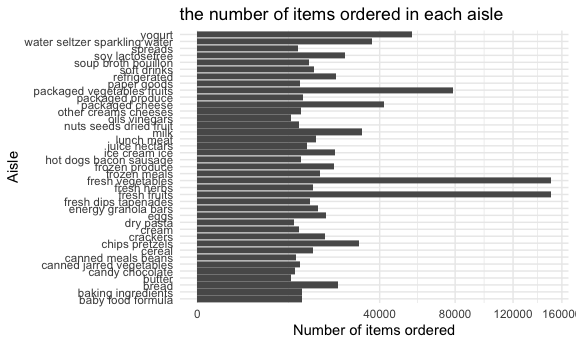
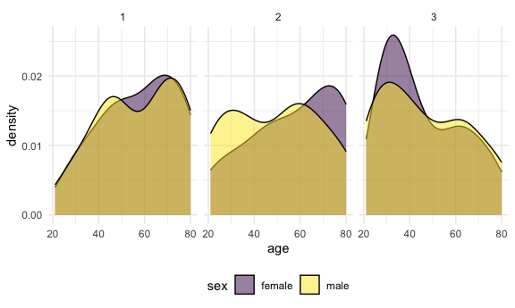
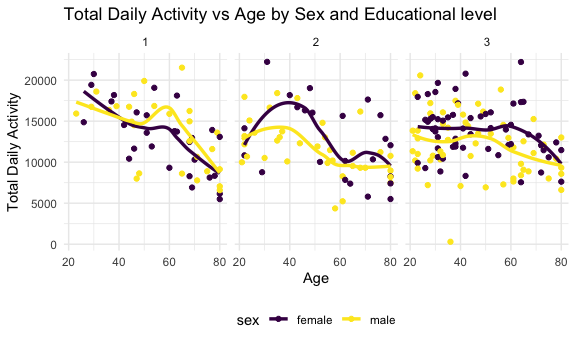
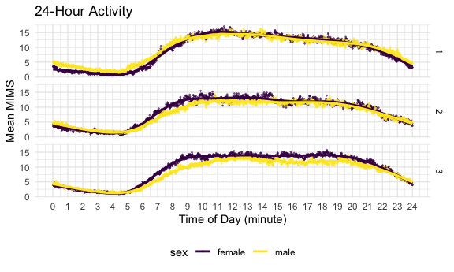

p8105_hw3_hc3671
================
Barry
2025-10-06

## Problem 1

Loading data and set options:

``` r
library(p8105.datasets)
library(ggridges)              
library(tidyverse)
```

    ## ── Attaching core tidyverse packages ──────────────────────── tidyverse 2.0.0 ──
    ## ✔ dplyr     1.1.4     ✔ readr     2.1.5
    ## ✔ forcats   1.0.0     ✔ stringr   1.5.1
    ## ✔ ggplot2   3.5.2     ✔ tibble    3.3.0
    ## ✔ lubridate 1.9.4     ✔ tidyr     1.3.1
    ## ✔ purrr     1.1.0     
    ## ── Conflicts ────────────────────────────────────────── tidyverse_conflicts() ──
    ## ✖ dplyr::filter() masks stats::filter()
    ## ✖ dplyr::lag()    masks stats::lag()
    ## ℹ Use the conflicted package (<http://conflicted.r-lib.org/>) to force all conflicts to become errors

``` r
knitr::opts_chunk$set(
  fig.width = 6,
  fig.asp = .6,
  out.width = "90%"
)

theme_set(theme_minimal() + theme(legend.position = "bottom"))

options(
  ggplot2.continuous.colour = "viridis",
  ggplot2.continuous.fill = "viridis"
)

scale_colour_discrete = scale_colour_viridis_d
scale_fill_discrete = scale_fill_viridis_d

data("instacart")

instacart = janitor::clean_names(instacart)

instacart |> 
  count(department, name = "number") |>  # not gonna show results here for aes
  mutate(max_department = department[which.max(number)], min_department = department[which.min(number)])
```

    ## # A tibble: 21 × 4
    ##    department      number max_department min_department
    ##    <chr>            <int> <chr>          <chr>         
    ##  1 alcohol           5598 produce        bulk          
    ##  2 babies           14941 produce        bulk          
    ##  3 bakery           48394 produce        bulk          
    ##  4 beverages       114046 produce        bulk          
    ##  5 breakfast        29500 produce        bulk          
    ##  6 bulk              1359 produce        bulk          
    ##  7 canned goods     46799 produce        bulk          
    ##  8 dairy eggs      217051 produce        bulk          
    ##  9 deli             44291 produce        bulk          
    ## 10 dry goods pasta  38713 produce        bulk          
    ## # ℹ 11 more rows

``` r
num_customers = n_distinct(instacart$user_id)
mean_day_since_last_order = mean(instacart$days_since_prior_order)
max_dow = names(which.max(table(instacart$order_dow)))
min_dow = names(which.min(table(instacart$order_dow)))
total_product_number = sum(unique(instacart$product_id))
num_reorder = sum(instacart$reordered)
num_orderfirst = sum(1 - instacart$reordered)
```

I made a look at the whole data set, this is a data about information on
grocery orders on the Instacart online grocery platform in the United
States. It has 15 variables in total. Key variables include: `order_id`:
Unique identifier for each order. `user_id`: Identifier for the
customer. `product_id` and `product_name`: Identifier for the purchased
item. `department` and `aisle`: Categorical variables of the products.
`order_dow` and `order_hour_of_day`: Day of the week and hour of the
orders. `days_since_prior_order`: Number of days since the user’s
previous order. `reordered`: A binary indicator indicates whether the
user has purchased this product before (0/1).

I made some basic statistical tests like: there are 131209 customers and
971525040 products involved in this data, the mean of the
days_since_prior_order is 17.0661259, the max order_dow is 0, the
minimum order_dow is 3, the number of reodered cases is 828824, while
there are 5.55793^{5} customers that order online for the first time.

Next, I am gonna answer the questions listed in question 1:

(a). How many aisles are there, and which aisles are the most items
ordered from?

    ## # A tibble: 1 × 2
    ##   num_aisle most_ordered_aisle
    ##       <int> <chr>             
    ## 1       134 yogurt

There are 134 aisles, and yogurts are the most items.

(b). Make a plot that shows the number of items ordered in each aisle,
limiting this to aisles with more than 10000 items ordered. Arrange
aisles sensibly, and organize your plot so others can read it.

``` r
instacart |> 
  count(aisle, name = "num_aisle") |> 
  filter(num_aisle >= 10000) |>  
  ggplot(aes(x = aisle, y = num_aisle)) +
  geom_col() + 
  coord_flip() +
  labs(
    x = "Aisle",
    y = "Number of items ordered",
    title = "the number of items ordered in each aisle "
  ) +
  scale_y_continuous(trans = "sqrt")
```



(c). Make a table showing the three most popular items in each of the
aisles “baking ingredients”, “dog food care”, and “packaged vegetables
fruits”. Include the number of times each item is ordered in your table.

``` r
instacart |> 
  filter(aisle %in% c("baking ingredients", "dog food care", "packaged vegetables fruits")) |> 
  group_by(aisle) |> 
  count(product_name, name = "number_of_times", sort = TRUE) |> 
  mutate(numbers_ranking = min_rank(-number_of_times)) |> 
  filter(numbers_ranking %in% c(1, 2, 3))
```

    ## # A tibble: 9 × 4
    ## # Groups:   aisle [3]
    ##   aisle                      product_name        number_of_times numbers_ranking
    ##   <chr>                      <chr>                         <int>           <int>
    ## 1 packaged vegetables fruits Organic Baby Spina…            9784               1
    ## 2 packaged vegetables fruits Organic Raspberries            5546               2
    ## 3 packaged vegetables fruits Organic Blueberries            4966               3
    ## 4 baking ingredients         Light Brown Sugar               499               1
    ## 5 baking ingredients         Pure Baking Soda                387               2
    ## 6 baking ingredients         Cane Sugar                      336               3
    ## 7 dog food care              Snack Sticks Chick…              30               1
    ## 8 dog food care              Organix Chicken & …              28               2
    ## 9 dog food care              Small Dog Biscuits               26               3

(d). Make a table showing the mean hour of the day at which Pink Lady
Apples and Coffee Ice Cream are ordered on each day of the week; format
this table for human readers (i.e. produce a 2 x 7 table).

``` r
instacart |> 
  filter(product_name %in% c("Pink Lady Apples", "Coffee Ice Cream")) |> 
  group_by(product_name, order_dow) |> 
  summarise(
    mean_hour_of_day = mean(order_hour_of_day)
  ) |> 
  pivot_wider(
    names_from = order_dow,
    values_from = mean_hour_of_day
  ) |> 
  set_names(c("Product_name", "Sunday", "Monday", "Tuesday", "Wednesday", "Thursday", "Friday", "Saturday"))
```

    ## `summarise()` has grouped output by 'product_name'. You can override using the
    ## `.groups` argument.

    ## # A tibble: 2 × 8
    ## # Groups:   Product_name [2]
    ##   Product_name     Sunday Monday Tuesday Wednesday Thursday Friday Saturday
    ##   <chr>             <dbl>  <dbl>   <dbl>     <dbl>    <dbl>  <dbl>    <dbl>
    ## 1 Coffee Ice Cream   13.8   14.3    15.4      15.3     15.2   12.3     13.8
    ## 2 Pink Lady Apples   13.4   11.4    11.7      14.2     11.6   12.8     11.9

## Question 2

Import, clean, and otherwise tidy these datasets.

``` r
price= 
  read_csv("zillow_data/Zip_zori_uc_sfrcondomfr_sm_month_NYC.csv", na = "NA") |>
  janitor::clean_names() |> 
  mutate(
    county_name = str_remove(county_name, " County$")
  ) |>
  rename_with(~str_remove(.x, "^x"), .cols = "x2015_01_31" : "x2024_08_31") |> 
  rename(zip_code = region_name, county = county_name) |> 
  filter(!if_all(`2015_01_31`:`2024_08_31`, is.na)) |> 
  select(-c(region_type, state_name))
```

    ## Rows: 149 Columns: 125
    ## ── Column specification ────────────────────────────────────────────────────────
    ## Delimiter: ","
    ## chr   (6): RegionType, StateName, State, City, Metro, CountyName
    ## dbl (119): RegionID, SizeRank, RegionName, 2015-01-31, 2015-02-28, 2015-03-3...
    ## 
    ## ℹ Use `spec()` to retrieve the full column specification for this data.
    ## ℹ Specify the column types or set `show_col_types = FALSE` to quiet this message.

``` r
zip = 
  read_csv("zillow_data/Zip Codes.csv", na = "NA") |> 
  janitor::clean_names() 
```

    ## Rows: 322 Columns: 7
    ## ── Column specification ────────────────────────────────────────────────────────
    ## Delimiter: ","
    ## chr (4): County, County Code, File Date, Neighborhood
    ## dbl (3): State FIPS, County FIPS, ZipCode
    ## 
    ## ℹ Use `spec()` to retrieve the full column specification for this data.
    ## ℹ Specify the column types or set `show_col_types = FALSE` to quiet this message.

(a). There are 116 months between January 2015 and August 2024. How many
ZIP codes are observed 116 times? How many are observed fewer than 10
times? Why are some ZIP codes are observed rarely and others observed in
each month?

``` r
price |> 
  mutate(
    observed_time = rowSums(!is.na(across(`2015_01_31`:`2024_08_31`)))
  ) |> 
  summarise(
    num_all_observed = sum(observed_time == 116),
    num_observed_over_10 = sum(observed_time >= 10)
  )
```

    ## # A tibble: 1 × 2
    ##   num_all_observed num_observed_over_10
    ##              <int>                <int>
    ## 1               48                  123

There are 48 ZIP codes are observed 116 times. 123 of them are observed
fewer than 10 times.  
some ZIP codes are observed rarely and others observed in each month may
be because some ZIP codes are not used any more or some places that are
not converged only have a limited data available in Zillow, or maybe
some places were not a living area in the past.

(b). Create a reader-friendly table showing the average rental price in
each borough and year (not month). Comment on trends in this table.

``` r
bond_data = 
  left_join(
    price, 
    zip, 
    by = c("zip_code", "county")
  ) 

rent_change_by_year =  
  bond_data |> 
  pivot_longer(
    `2015_01_31`:`2024_08_31`,
    names_to = "date",
    values_to = "rent",
    values_drop_na = TRUE
  ) |>
  mutate(
    date = ymd(str_replace_all(date, "_", "-")),
    year = lubridate::year(date),
    borough = case_when(
      county == "New York"  ~ "Manhattan",
      county == "Kings"     ~ "Brooklyn",
      county == "Queens"    ~ "Queens",
      county == "Bronx"     ~ "The Bronx",
      county == "Richmond"  ~ "Staten Island"
    )
  )  
  
rent_change_by_year |> 
  group_by(borough, year) |> 
  summarize(
    mean_rent = mean(rent, na.rm = TRUE),
    .groups = "drop"
  ) |> 
  pivot_wider(
    names_from = year,
    values_from = mean_rent
  ) |>   
  mutate(
    across(where(is.numeric), ~ round(.x, 1)),
    across(everything(), ~ ifelse(is.na(.x), "-", .x)))
```

    ## # A tibble: 5 × 11
    ##   borough  `2015` `2016` `2017` `2018` `2019` `2020` `2021` `2022` `2023` `2024`
    ##   <chr>    <chr>  <chr>  <chr>  <chr>  <chr>   <dbl>  <dbl>  <dbl>  <dbl>  <dbl>
    ## 1 Brooklyn 2492.9 2520.4 2545.8 2547.3 2630.5  2555.  2550.  2868.  3015.  3127.
    ## 2 Manhatt… 3022   3038.8 3133.8 3183.7 3310.4  3106.  3137.  3778.  3933.  4078.
    ## 3 Queens   2214.7 2272   2263.3 2291.9 2387.8  2316.  2211.  2406   2562.  2694 
    ## 4 Staten … -      -      -      -      -       1978.  2045.  2147.  2333.  2536.
    ## 5 The Bro… 1759.6 1520.2 1543.6 1639.4 1705.6  1811.  1858.  2054.  2286.  2497.

From 2015 to 2024, the rent in every borough shows an increasing trend,
especially after 2021, which allies with the Covid-19 pandemic. Plus,
there is a decrease in Brooklyn, Manhattan and Queens around 2019 and
2020. Manhattan’s mean rent is always the highest among all, while the
Bronx’s is the lowest.

(c).Make a plot showing NYC Rental Prices within ZIP codes for all
available years. Your plot should facilitate comparisons across
boroughs. Comment on any significant elements of this plot.

``` r
mean_price_2015_2024 =
  rent_change_by_year |>
  group_by(borough, year) |>
  summarize(mean_rent = mean(rent, na.rm = TRUE), .groups = "drop") |>
  ggplot(aes(x = year, y = mean_rent, color = borough)) +
  geom_point() + geom_line() +
  theme(legend.position = "bottom") +
  labs(title = "NYC Rental Prices Across Boroughs (2015–2024)", x = "Year", y = "Average Rent", )
```

I tried to make a plot that includes all the zip code points together,
but it is really not readable, I think this plot is what it is supposed
to be. From the plot, we can see the mean rents have increased across
all the boroughs, but with a very clear dip in 2020 because of the
pandemic, except the Bronx (Bronx had a dip in 2016). The Staten Island
only have data from 2020, while others are from 2015 to 2024.

(d). Compute the average rental price within each ZIP code over each
month in 2023. Make a reader-friendly plot showing the distribution of
ZIP-code-level rental prices across boroughs; put differently, your plot
should facilitate the comparison of the distribution of average rental
prices across boroughs. Comment on this plot.

``` r
rent_2023 =
  rent_change_by_year |>
  filter(year == 2023) |>
  mutate(month = lubridate::month(date)) |>
  group_by(zip_code, borough, year, month) |>
  summarise(mean_rent = mean(rent))
```

    ## `summarise()` has grouped output by 'zip_code', 'borough', 'year'. You can
    ## override using the `.groups` argument.

``` r
# without months
price2023_without_month <-
  rent_2023 |>
  ggplot(aes(x = mean_rent, fill = borough)) +
  geom_density(alpha = .4) +
  theme(legend.position = "bottom") +
  labs(title = "Distribution of ZIP-Code-Level Rental Prices by Borough (2023)", y = "Average Monthly Rent")


# include month
price2023_with_month <- 
rent_2023 |>
  mutate(month = factor(month, levels = 1:12, labels = month.name)) |>
  ggplot(aes(x = mean_rent, y = borough, fill = borough)) +
  geom_density_ridges(alpha = 0.7,
                      scale = 1.05,
                      color = NA) +
  facet_wrap( ~ month, ncol = 4) +
  labs(title = "Distribution of ZIP-level Average Monthly Rent by Borough (2023)", x = "Average Monthly Rent ($)", y = NULL) +
  theme_minimal(base_size = 12) +
  theme(legend.position = "none")
```

The two plots above each shows the overall distribution and distribution
by months of the five boroughs. From the second plot, we can see that
there are slight difference between months, then we just see the overall
pattern. Staten Land, Bronx and Queens’s rental prices are converged
around 2200, Brooklyn’s has a peak around 2800, Manhatten has the
highest price, which is almost around 4200. Moreover, Staten Land, Bronx
and Queens’s rental prices are relatively concentrated. In contrast,
Manhattan and Brooklyn show more dispersed distributions, suggesting
greater within-borough variability in rental prices.

(e). Combine the two previous plots into a single graphic, and export
this to a results folder in your repository.

``` r
library(patchwork)
combine <- mean_price_2015_2024 + price2023_without_month +
  plot_annotation(
    title = "Combination",
  )
dir.create("results")
```

    ## Warning in dir.create("results"): 'results' already exists

``` r
ggsave(
  filename = "results/combined_plot.png",
  plot = combine,
  width = 12,
  height = 8,
  bg = "white"
)
```

## Question 3

``` r
paticipant_df = 
  read_csv("https://p8105.com/data/nhanes_covar.csv", skip = 4) 
```

    ## Rows: 250 Columns: 5
    ## ── Column specification ────────────────────────────────────────────────────────
    ## Delimiter: ","
    ## dbl (5): SEQN, sex, age, BMI, education
    ## 
    ## ℹ Use `spec()` to retrieve the full column specification for this data.
    ## ℹ Specify the column types or set `show_col_types = FALSE` to quiet this message.

``` r
accelerometer_df = 
  read_csv("https://p8105.com/data/nhanes_accel.csv")
```

    ## Rows: 250 Columns: 1441
    ## ── Column specification ────────────────────────────────────────────────────────
    ## Delimiter: ","
    ## dbl (1441): SEQN, min1, min2, min3, min4, min5, min6, min7, min8, min9, min1...
    ## 
    ## ℹ Use `spec()` to retrieve the full column specification for this data.
    ## ℹ Specify the column types or set `show_col_types = FALSE` to quiet this message.

``` r
nhanes = 
  left_join(
    paticipant_df,
    accelerometer_df,
    by = "SEQN"
  ) |> 
  drop_na() |> 
  filter(age >= 21) |> 
  mutate(
    age = as.integer(age),
    education = as.factor(education),
    sex = 
      case_match(
        sex, 
        1 ~ "male", 
        2 ~ "female")
  )
```

(a). Produce a reader-friendly table for the number of men and women in
each education category, and create a visualization of the age
distributions for men and women in each education category. Comment on
these items.

``` r
# plot of the number of men and women in each education category
nhanes |> 
  count(education, sex, name = "population") |> 
  pivot_wider(
    names_from = sex,
    values_from = population
  )
```

    ## # A tibble: 3 × 3
    ##   education female  male
    ##   <fct>      <int> <int>
    ## 1 1             28    27
    ## 2 2             23    35
    ## 3 3             59    56

``` r
# visualization

nhanes |> 
  ggplot(aes(x = age, fill = sex)) +
  geom_density(alpha = .5) +
  facet_grid(~education) +
  viridis::scale_fill_viridis(discrete = TRUE)
```



From the plot, for education level 1, makes and females are basically
the same. For education level 2, males have a larger part of the younger
age than females, and for education level 3, females’ population has a
heavier density around age of 30.

(b). Traditional analyses of accelerometer data focus on the total
activity over the day. Using your tidied dataset, aggregate across
minutes to create a total activity variable for each participant. Plot
these total activities (y-axis) against age (x-axis); your plot should
compare men to women and have separate panels for each education level.
Include a trend line or a smooth to illustrate differences. Comment on
your plot.

``` r
nhanes_activity  =
  nhanes |>
  mutate(total = rowSums(select(nhanes , min1:min1440), na.rm = TRUE))

nhanes_activity |> 
  ggplot(aes(x = age, y = total, color = sex)) +
  geom_point() +
  geom_smooth(method = "loess", se = FALSE, size = 1.2) +
  facet_grid(~ education) +
  labs(
    title = "Total Daily Activity vs Age by Sex and Educational level",
    x = "Age", y = "Total Daily Activity"
  ) 
```

    ## Warning: Using `size` aesthetic for lines was deprecated in ggplot2 3.4.0.
    ## ℹ Please use `linewidth` instead.
    ## This warning is displayed once every 8 hours.
    ## Call `lifecycle::last_lifecycle_warnings()` to see where this warning was
    ## generated.

    ## `geom_smooth()` using formula = 'y ~ x'



For education level 1, female has more daily activity than male before
40, and then change after 40, with a peak for male aged 60.  
For education level 2, female’ total daily activity is more than male’s
almost among all age, with a peak in 40 and 70 in both make and
female.  
For education level 3, male and female’s total daily activity pattern
are almost the same. But the line shows that female still has more total
daily activity than male.

(c). Accelerometer data allows the inspection activity over the course
of the day. Make a three-panel plot that shows the 24-hour activity time
courses for each education level and use color to indicate sex. Describe
in words any patterns or conclusions you can make based on this graph;
including smooth trends may help identify differences.

``` r
nhanes |> 
  pivot_longer(
     min1:min1440,
     names_to = "time",
     values_to = "mims"
  ) |> 
  mutate(
    time = parse_number(time) / 1440 *24,
  ) |> 
  group_by(education, sex, time) |> 
  summarise(
    mean_mims = mean(mims)
  ) |> 
  ggplot(aes(x = time, y = mean_mims, color = sex)) +
  geom_point(alpha = .5, size = .3) +
  geom_smooth(se = FALSE) + 
  scale_x_continuous(
    limits = c(0, 24),
    breaks = seq(0, 24, by = 1)) +
  facet_grid(education ~.) +
  labs(
    title = "24-Hour Activity",
    x = "Time of Day (minute)",
    y = "Mean MIMS"
  )
```

    ## `summarise()` has grouped output by 'education', 'sex'. You can override using
    ## the `.groups` argument.
    ## `geom_smooth()` using method = 'gam' and formula = 'y ~ s(x, bs = "cs")'



``` r
  theme(legend.position = "bottom")
```

    ## List of 1
    ##  $ legend.position: chr "bottom"
    ##  - attr(*, "class")= chr [1:2] "theme" "gg"
    ##  - attr(*, "complete")= logi FALSE
    ##  - attr(*, "validate")= logi TRUE

The general pattern (of all the educational level), the activity follows
a clear circadian rhythm: Lowest level during the night (roughly 0-6
am), A sudden increase after waking (around 6–8 am), Peak activity
sustained throughout the daytime (10 am–5 pm), Gradual decline into the
evening hours (after 8 pm).

Then, let group 1,2,3 denotes different educational levels of people.
Group 1 reaches the peak about two hours later than the other two
groups. And group 3’s pattern is flatter during the peak activity period
than others and turns to decline sharper after work (around 7 pm). It
seems that group two has a large variance of MIMS almost the daytime.
And there is almost the same pattern of males and females.
